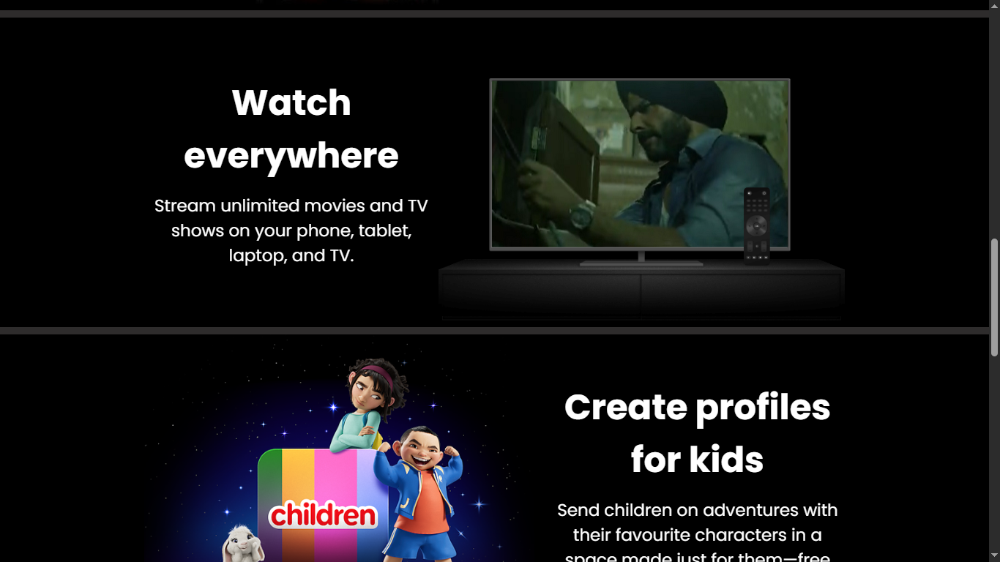
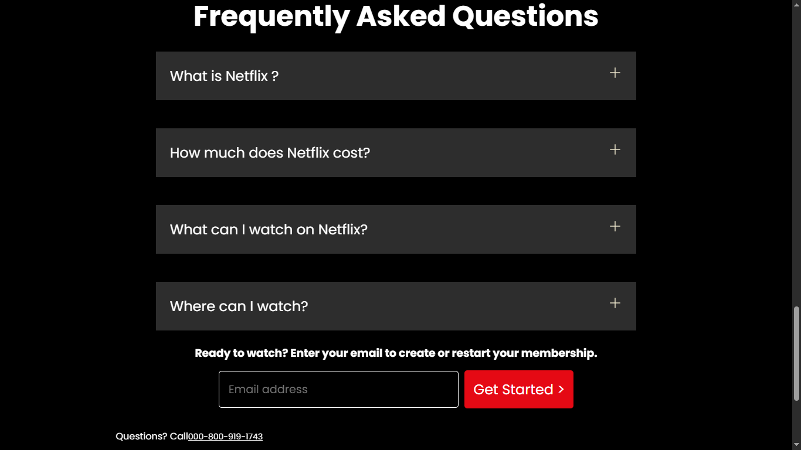

# 🎬 Netflix UI Clone

A responsive **Netflix landing page UI clone** built using **HTML** and **CSS** only — no frameworks, no JavaScript. This project focuses on layout structure, proper font usage, hover interactions, and accurate color implementation to mimic the real Netflix homepage.

---

## 🔥 Features

- 💻 **Fully responsive** design for all screen sizes
- 🎨 **Custom fonts and Netflix-style colors**
- 🖱️ **Hover effects** on buttons and links
- 🔡 Clean and structured **HTML & CSS code**
- 🧩 Pixel-perfect alignment of elements

---

## 📸 Preview






---

---

## 🚀 Getting Started

1. Clone the repo:
   ```bash
   git clone https://github.com/C-W-Praduman/Netflix-UI-Clone-Css.git


---
## 📁 Folder Structure
Netflix-UI-Clone-Css/
├── index.html
├── style.css
├── screenshot.png
└── README.md


## 👨‍💻 Built with 💙 by Praduman Gupta